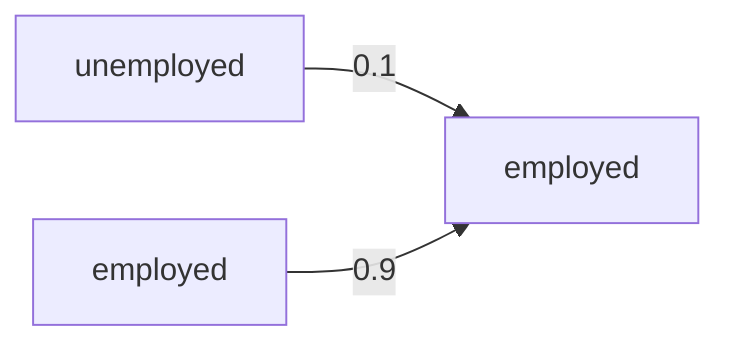
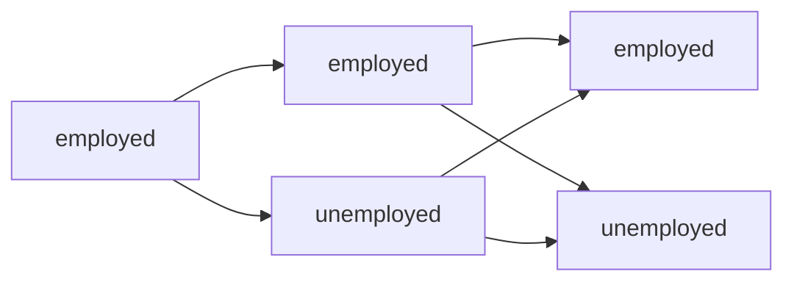
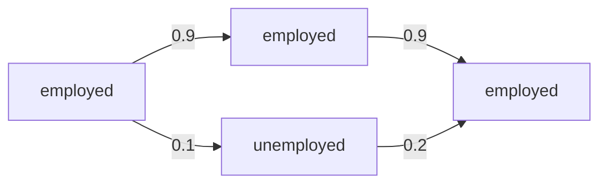

## Markov chain
### Transition matrix
$$
\mathbf P = \begin{bmatrix}
p_{11} & p_{12} & ...\\
p_{21} & p_{22} & ...\\
...
\end{bmatrix}
$$
with $p_{ij} = \Pr(x_t=j|x_{t-1}=i)$. Each row is a PMF.

Example
$$
\begin{bmatrix}
0.9 & 0.1\\
0.2 & 0.8
\end{bmatrix}
$$
$p_{kk}$ are somewhat special in that they measure prob of **remaining** in state $k$.

### Boundary condition
Where to start the system from?

Maybe some initial value $x_0$. Say, start from employment, $x_0 = 1$.

Instead, more generally, start from $\pi_0$, a PMF. This includes $\{1.0, 0.0\}$, but also $\{0.5, 0.5\}$.

### One-period forecast
$$
\Pr(x_1 = j) = ?
$$
If initially I was employed, $x_0=1$, I can use conditional prob,
$$
\Pr(x_1=j) = \Pr(x_1=j|x_0=1) = p_{1j}.
$$
Enumerate the different ways in which $x_1$ can become 1:
1. $x_0=1$ (employment) and stayed there
2. $x_0=2$ (unemployment) and switched to 1 

What is the prob of $x_0=1$? $\pi_{01} = 0.5$

### Maybe less confusing
We do start from $x_0=1$. But! forecast for 2 periods:

What is the prob of $x_2 = 1$?

Add up two paths through which I can be employed in period 2:
1. $0.9\times 0.9=0.81$ 
2. $0.1\times 0.2=0.02$

$$
\Pr(x_2=1|x_0=1) = 0.81 + 0.02 = 0.83
$$
$$
\Pr(x_2=1|x_0=1) = 
\sum_{k=1}^K \Pr(x_2=1|x_1=k)\Pr(x_1=k|x_0=1)
$$
$$
=\sum_{k=1}^K p_{k1}\times p_{1k}
$$
### Back to q
Start from $\pi_0$. 
$$
\pi_{1j}:=\Pr(x_1 = j) = 
\sum_{k=1}^K 
\Pr(x_1=j|x_0=k)\Pr(x_0=k)
$$
$$
=\sum_{k=1}^K p_{kj}\pi_{0k}=[\mathbf P' \pi_0]_j.
$$
In matrix notation
$$
\pi_1 = \mathbf P' \pi_0,
$$
or 
$$
\pi_t = \mathbf P' \pi_{t-1}.
$$
> **Break until 14:34**

Check: if $x_0=1$ then $\pi_0=(1,0)= \mathbf e_1$ and
$$
\pi_1 = \mathbf P' \mathbf e_1
$$
is the first row if $\mathbf P$, the conditional probs for time 1.

### Two-period forecast
$$
\pi_{t+2} =\mathbf P'\mathbf P'\pi_t = (\mathbf P^2)' \pi_t
$$

## 2022-11-23
For $t$-period forecast
$$
\pi_t =  (\mathbf P')^t \pi_0
$$
Use eigenvalue decomposition
$$
\mathbf P' \mathbf v_i = \lambda_i \mathbf v_i
$$
Is it possible to converge to a steady state PMF? This means that
$$
\mathbf P' \pi_* = 1\times \pi_*.
$$
This means that $\lambda_i=1$ with corresponding eigenvector of $\pi_*$. 

> NOTE: We have shown that $\pi_*$ is unique. We have not shown that $\lim_{t\to\infty} (\mathbf P')^t\pi_0 = \pi_*$.

If exists $\lambda_1 = 1$, then $\pi_{(1)}$ is a steady state such that $\pi_t=\pi_{(1)}$ if started from $\pi_{(1)}$ for all $t$.

### Formal statements 
1. For stochastic $P$, 1 is always an eigenvalue. 
Remember
$$
\mathbf P \mathbf 1 = \mathbf 1, 
$$
which is an eigenvalue equation! Meaning 1.0 is an eigenvalue of $P$.  And the eigenvalues of P and P' are the same, but with probably *different* eigenvector!
$$
\mathbf P = \mathbf Q \mathbf \Lambda \mathbf Q^{-1}
$$
$$
\mathbf P' = \mathbf Q^{-1}{}' \mathbf \Lambda' \mathbf Q'
$$
but since $\Lambda$ is diagonal, $\Lambda = \Lambda '$. 

1a. There may be *multiple* eigenvalues of 1.
1b. Eigenvector 1 only has non-negative elements. This means we can scale to PMF.

2. All eigenvalues $|\lambda_i| \le 1$. TODO: link to proof
3. Question: for $K>2$ can we have pairs of complex conjugates as eigenvalues?

For any $\pi_0$, write it as a linear combination of eigenvectors:
$$
\pi_0 = \sum_{i=1}^K\alpha_{i0} \mathbf v_i
$$
(under "some" conditions, TODO: clarify, possibly true for non-singular transition matrices)
$$
\pi_1 = \mathbf P'\pi_0 = 
\sum_{i=1}^K\mathbf P'\alpha_{i0} \mathbf v_i = 
\sum_{i=1}^K\alpha_{i0} \lambda_i \mathbf v_i.
$$
I can write $\pi_1$ as a different linear combination, with $\alpha_{i1} = \alpha_{i0}\lambda_i$. More generally, 
$$
\pi_t = \sum_{i=1}^K \alpha_{i0}\lambda_i^t \mathbf v_i.
$$
Take out first eigenvector,
$$
\pi_t = \alpha_{10} \pi_* + \sum_{i=2}^K \alpha_{i0}\lambda_i^t\mathbf v_i.
$$
distance from steady state: $\alpha_2 ...$ , speed of convergence : $\lambda_2 ...$ 